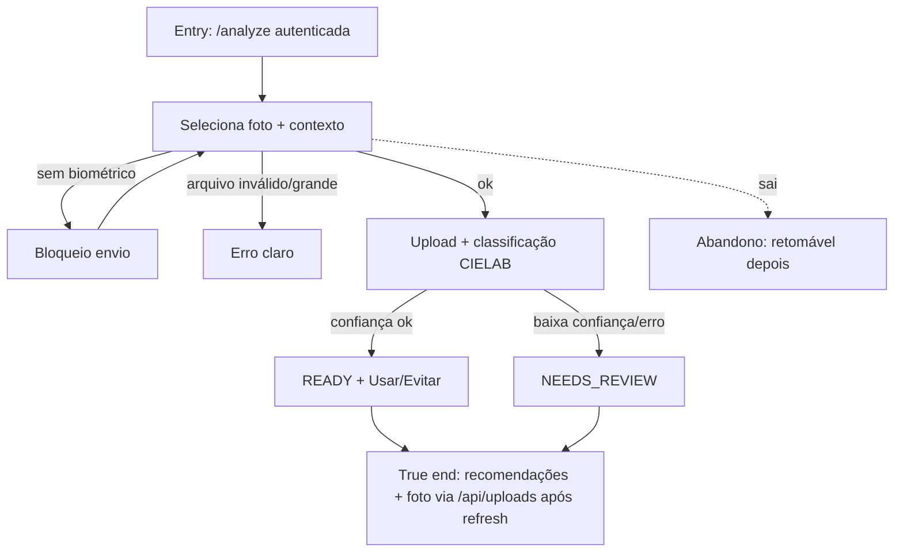

# J-analyze-ready-results



```yaml
journey:
  id: J-analyze-ready-results
  name: Rodar análise self-service até o resultado
  value_statement: "Usuária autenticada obtém estação e recomendações a partir de uma foto válida"
  personas: [Lia, Sofia]
  entry_points:
    - url: http://localhost:3000/analyze
      origin: in-app-nav
  actions:
    - step: 1
      verb: Escolhe imagem e contexto (casual/trabalho/noite)
      expected_observable: Preview e controles habilitados
    - step: 2
      verb: Aceita biométrico e envia
      expected_observable: Feedback de processamento sem travar silenciosamente
    - step: 3
      verb: Lê o resultado
      expected_observable: Estação, Usar/Evitar, make e foto
  goal:
    observable: Status READY ou NEEDS_REVIEW com conteúdo legível
    side_effects: [record-created, private-upload]
  true_end_state: Mesmo resultado após refresh; upload não é URL pública
  exit:
    natural: /analyses/[id] com ações VTO / revisão
  abandonment:
    - at_step: 2
      how: Rede cai no upload
      resume: Nova tentativa em /analyze; registro parcial só se API persistiu
  crosses: [storage, analysis-pipeline]
```
