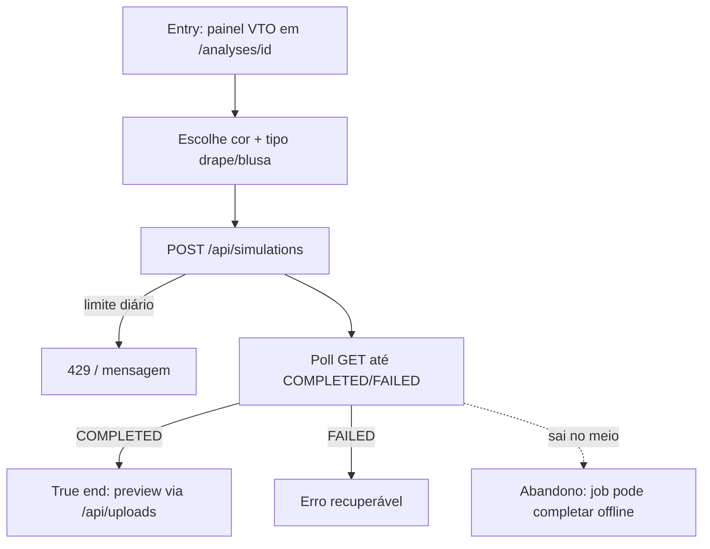

# J-vto-color-simulation



```yaml
journey:
  id: J-vto-color-simulation
  name: Simular cor no rosto/look
  value_statement: "Dona da análise visualiza uma simulação VTO concluída a partir do resultado"
  personas: [Sofia, Lia]
  entry_points:
    - url: http://localhost:3000/analyses/[id]
      origin: in-app-nav
  actions:
    - step: 1
      verb: Escolhe cor e tipo de simulação
      expected_observable: Controles VTO visíveis (dona)
    - step: 2
      verb: Dispara simulação e aguarda
      expected_observable: Estado de progresso até COMPLETED ou FAILED
    - step: 3
      verb: Vê o preview
      expected_observable: Imagem de saída autenticada
  goal:
    observable: Job COMPLETED com preview carregando
    side_effects: [simulation-job, private-upload]
  true_end_state: Preview permanece após refresh; limite diário comunicado se atingido
  exit:
    natural: Mesma página com histórico/preview da simulação
  abandonment:
    - at_step: 2
      how: Fecha a aba durante o poll
      resume: Reabre análise; job pode já estar COMPLETED
  crosses: [vto-provider, storage]
```
